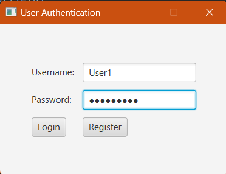
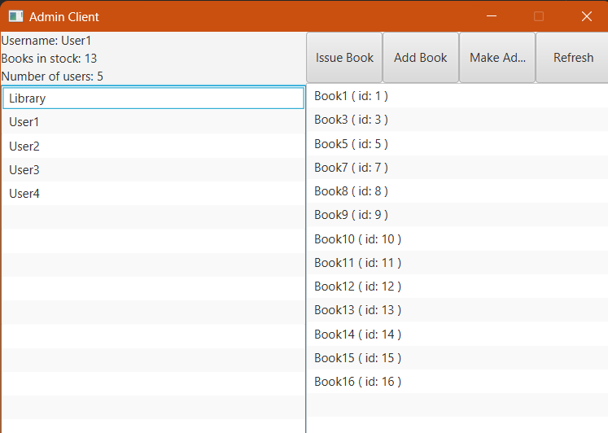
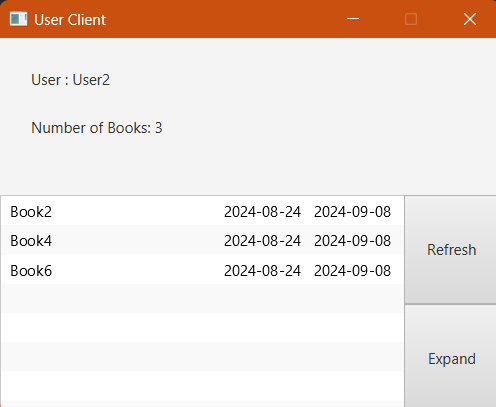

# Library Application Backend

This is the backend application for the Library Manager

## Table of Contents

- [Introduction](#introduction)
- [Features](#features)
- [Setup](#setup)
- [Examples](#examples)

## Introduction

A simple backend built on RESTful principles using NodeJS, ExpressJS, and PostgreSQL. Uses JWT and OAUTH based user authentication.

## Features

- User/Admin authentication using jsonwebtokens and OAUTH2
- RESTful API
- Robust endpoints with error handling
- Provides endpoints for Admins and Users

## Setup

1. Clone the repository:
   ```sh
   git clone https://github.com/RSYashwanth/Library-Backend.git
   ```
2. Build and run containers using docker-compose:
   ```sh
   docker-compose up
   ```
3. Follow instructions to run Client application
   
## Examples

1. 
2. 
3. 

